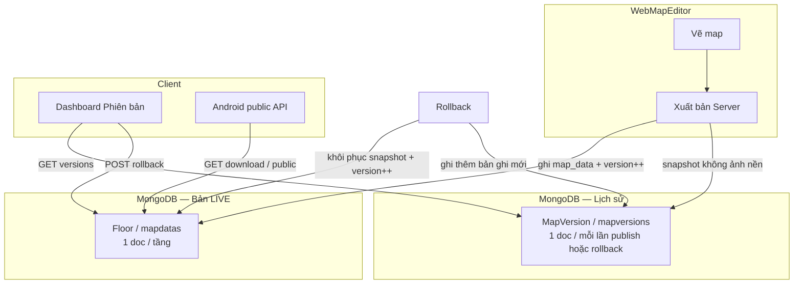
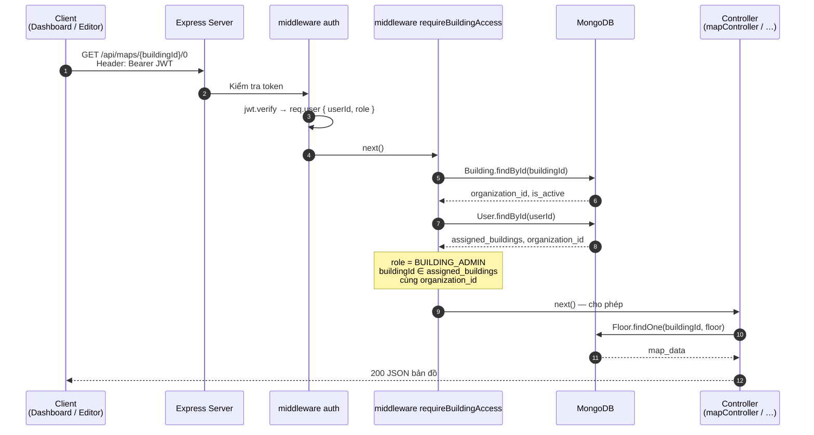
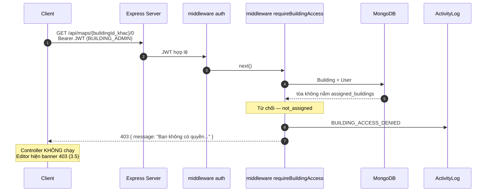

# HANDOFF — INDOOR NAVIGATION SAAS ROADMAP

> File bàn giao cho mọi tab Cursor AI (mới hoặc cũ). **Đọc mục 7 trước khi làm task.**
> Luôn `@SaaS.md` + `@Docs/style1code.md`. Bug: thêm `@Docs/DEBUG_PROMPT.md`.
> Cập nhật lần cuối: 2026-07-14 (Phase 7 + SMTP email reset PASS; `test:phase7` 17/17; chờ commit/PR)

---

## 0. QUICK CONTEXT (copy nhanh vào tab mới)

```text
@SaaS.md @Docs/style1code.md

Đọc mục 3 (vị trí hiện tại) và mục 7 (quy trình làm việc) trước khi code.

Dự án Indoor Navigation (luận văn → SaaS).
Phase 1A ✅ | Phase 1B ✅ | Phase 2 — **chốt** (2.1–2.9 ✅).
Đã xong: Phase 3 ✅, Phase 4 ✅, Phase 5.0–5.8 ✅, Phase 6 Analytics ✅, Floor ✅.
Phase 7 Enterprise Security — code + test 17/17 + checklist tay + SMTP email ✅ (nhánh giai-doan-7-bao-mat, chờ merge).
Tiếp: commit/PR Phase 7 (+ SMTP) → rồi Phase 1C (avatar/2FA) hoặc production JWT.
Chỉ sửa đúng scope task. Không sửa Android nếu không yêu cầu.
Trả lời tiếng Việt.
```

---

## 1. MỤC TIÊU TỔNG THỂ

- **Đồ án:** Hệ thống bản đồ và dẫn đường trong nhà
- **Hướng:** Đồ án → MVP → SaaS Platform
- **Mô hình:** End user app miễn phí; khách trả phí là Organization (trường, bệnh viện, TTTM)
- **Giá trị SaaS chính:** Organization → Building → Floor → Map → QR → Role → Workflow
- **Không ưu tiên sớm:** Avatar, 2FA, Notification (để Phase 1C / Phase 7)

---

## 2. KIẾN TRÚC (5 PHẦN — TÁCH APP)

| Phần | Stack | Ghi chú |
|------|-------|---------|
| `Backend_server/` | Node.js + Express 5 + MongoDB | API SaaS, admin, billing, webhook. Local: `http://localhost:5000` |
| `WebMapEditor/` | HTML/CSS/JS | Route `/editor`, publish map |
| `IndoorNavigationApp/` | Kotlin + Compose | **App chỉ đường trong nhà** — QR bản đồ → PDR+TPF → A*. **Build APK riêng** |
| `TPTPpay/` | HTML/JS (+ API sandbox) | **Cổng thanh toán ảo** (mô phỏng VNPay) — trang merchant + QR thanh toán |
| `TPTPbank/` | Kotlin + Compose (dự kiến) | **App ngân hàng ảo** — đăng nhập, nạp tiền, quét QR camera, xác nhận trả. **Build APK riêng, không gộp IndoorNavigationApp** |

**Luồng chỉ đường:** Admin vẽ map → publish → User quét **QR bản đồ** → định vị → chọn đích → chỉ đường

**Luồng thanh toán (Phase 5.8):** ORG_ADMIN checkout → **TPTPpay** (QR) → **TPTPbank** quét QR → xác nhận → webhook → gói ACTIVE

**Quy trình chi tiết:** `Docs/WORLDFLOW_TPTP_SANDBOX.md`

**Lưu ý:** QR bản đồ (định vị) và QR thanh toán (billing) là **hai loại QR khác nhau**, hai app khác nhau.

---

## 3. VỊ TRÍ HIỆN TẠI

```
Phase 1A  [████████████████████] chốt — chỉ bugfix nếu cần
Phase 1B  [████████████████████] chốt — regression pass 2026-06-26
Phase 1C  [░░░░░░░░░░░░░░░░░░░░] chưa bắt đầu
Phase 2   [████████████████████] chốt — 2.1–2.9 ✅
Phase 3   [████████████████████] 3.1–3.9 ✅ — **chốt Phase 3 MVP**
Phase 4   [████████████████████] 4.1–4.6 ✅ — **chốt Phase 4 Dashboard**
Phase 5   [████████████████████] 5.0–5.8 ✅ — **CHỐT Phase 5 Billing + TPTP Sandbox**
Phase 6   [████████████████████] 6.1–6.5 ✅ — **CHỐT Phase 6 Analytics**
Phase 7   [████████████████████] 7.0–7.8 + SMTP ✅ — đã merge main
Phase 8   [████████████░░░░░░░░] đang làm — Web Draft/Lock/Permit/Google (`giai-doan-8-web-upgrade`)
Phase 9   [░░░░░░░░░░░░░░░░░░░░] đề xuất — Finance FMS
```

**Giai đoạn lớn:** Phase 8 — Web Collaboration & Publish Safety **đang làm**  
**Floor lifecycle:** ✅ (PR #17)  
**Version tiếp theo:** P8 rồi P9 — `Nang_cap_he_thong_backendserver.md` · `Docs/WORLDFLOW_PHASE8_WEB_UPGRADES.md`  
**Tiếp sau P8:** Phase 9 FMS; Phase 1C (avatar/2FA) ưu tiên thấp

**Tạm dừng:** WebMapEditor V4 — không ưu tiên khi đang làm SaaS.

**Thanh toán:** Mock 1-click (5.7) đã **thay** bởi TPTP Sandbox (5.8). VNPay thật vẫn giữ cho production (`VNPAY_*` env).

---

## 4. ĐÃ CHỐT PHƯƠNG ÁN

### 4.1 Roadmap tổng (thứ tự đã đồng ý)

| Phase | Tên | Ưu tiên |
|-------|-----|---------|
| 1A | User Management MVP | ✅ Xong |
| 1B | Security + SaaS Foundation | ✅ Xong (1B.FINAL pass 2026-06-26) |
| 1C | Enterprise User (avatar, 2FA, notification) | Thấp — làm sau |
| 2 | Organization Management | ✅ Xong |
| 3 | Map Management + Workflow | ✅ Xong |
| 4 | Super Admin Dashboard nâng cao | ✅ Xong (4.1–4.6 pass 2026-07-08) |
| 5 | Billing + Subscription | ✅ **CHỐT** 5.0–5.8 (TPTP Sandbox E2E 2026-07-10) |
| 6 | Analytics | ✅ **CHỐT** 6.1–6.5 (2026-07-11) |
| 7 | Enterprise Security | ✅ CHỐT (merge main 2026-07-14) |
| 8 | Web Collaboration & Publish Safety | 🔄 Đang làm — nhánh `giai-doan-8-web-upgrade` |
| 9 | Financial Management (FMS) | Đề xuất — sau P8 |

**Nguyên tắc:** Organization lên sớm, không chờ hết avatar/2FA. Multi-tenant: một DB, filter `organization_id`.

### 4.2 Auth & User (Phase 1A)

| Quyết định | Chi tiết |
|------------|----------|
| Public register | `POST /api/auth/public-register` → `is_active: false`, chờ duyệt |
| Admin tạo user | `POST /api/auth/register` → cần `SUPER_ADMIN` |
| Role | `SUPER_ADMIN` / `BUILDING_ADMIN` |
| User inactive | Login bị chặn — message chờ duyệt |
| Xóa user | Soft delete (`is_active: false`), không hard delete |

### 4.3 RBAC Building (Phase 1B.1 ✅)

| Ai | Quyền |
|----|--------|
| `SUPER_ADMIN` | Toàn quyền mọi building |
| `BUILDING_ADMIN` | Chỉ `assigned_buildings` |
| `PUT /api/buildings/:id` | Super Admin hoặc assigned Building Admin |
| `DELETE /api/buildings/:id` | Chỉ Super Admin → **soft delete** (`is_active: false`, log `DEACTIVATE_BUILDING`) |
| Deny access | Log `BUILDING_ACCESS_DENIED` |

**Public routes (Android, không auth):**
- `GET /api/buildings/public`
- `GET /api/buildings/check-location`
- `GET /api/maps/:buildingId/:floor/public`
- `GET /api/maps/:buildingId/download`

**File:** `middlewares/buildingAccess.js`, gắn ở `buildingRoutes`, `mapRoutes`, `mapVersionRoutes`

### 4.4 Rate Limit (Phase 1B.2 ✅)

| Endpoint | Limit |
|----------|-------|
| `POST /api/auth/login` | 5 / 15 phút / IP, `skipSuccessfulRequests: true` |
| `POST /api/auth/public-register` | 3 / giờ / IP |
| `POST /api/auth/refresh` | 20 / 15 phút / IP |
| `/register`, `/logout`, `/unlock-session` | Không limit |

**File:** `middlewares/rateLimit.js`, gắn trong `authRoutes.js`  
**Package:** `express-rate-limit` ^8.5.2

### 4.5 Helmet + CORS (Phase 1B.3 ✅)

| Quyết định | Chi tiết |
|------------|----------|
| CORS | `CORS_ORIGIN` env, comma-separated origins |
| Dev default | `localhost:5000`, `3000`, `127.0.0.1:5000` |
| Helmet | Bật, `contentSecurityPolicy: false` (admin/editor inline scripts) |
| Production | **Bắt buộc** set `CORS_ORIGIN` trên Render |

```env
# Ví dụ .env production (KHÔNG commit file .env)
CORS_ORIGIN=http://localhost:5000,https://your-app.onrender.com
```

### 4.6 Soft Delete Buildings (Phase 1B.4 ✅)

| Quyết định | Chi tiết |
|------------|----------|
| Xóa building | `is_active: false`, không `findByIdAndDelete` |
| List mặc định | `is_active: { $ne: false }` (tòa cũ không có field vẫn hiện) |
| Super Admin | `GET /api/buildings?include_inactive=true` để xem inactive |
| ActivityLog | `DEACTIVATE_BUILDING` (giữ `DELETE_BUILDING` enum cũ) |
| Public/Android | `checkLocation` + `/public` chỉ building `is_active: true` |
| Building inactive | **BUILDING_ADMIN** bị chặn map/building (403). **SUPER_ADMIN** vẫn bypass `requireBuildingAccess` (có thể audit map inactive qua API) |
| Restore | Chưa có API — sau này set `is_active: true` thủ công hoặc thêm endpoint |

### 4.7 Để sau (chưa làm)

- Email verification, forgot password
- Avatar, 2FA, Notification Center
- Billing / quota / payment
- JWT expiry tuning (1B.6 optional)
- Multi-tab dashboard sync (1B.7 optional)

### 4.8 Organization & Multi-tenant (Phase 2 — ✅ CHỐT trước 2.1)

> Quyết định do user đề xuất, review 2026-06-26. **Không đổi** trừ khi user yêu cầu.

| Câu hỏi | Phương án chốt | Ghi chú |
|---------|----------------|---------|
| Data cũ không có `organization_id`? | **Migration** → 1 org mặc định: `slug: "legacy"`, `name: "Legacy / Default"`, `is_active: true` | Tránh `organization_id: null` lan man trên Building |
| `Building.organization_id` | **Required** sau migration (schema + validate API tạo/sửa) | Multi-tenant rõ ràng |
| `User.organization_id` | **Optional** — `SUPER_ADMIN`: `null`; `BUILDING_ADMIN`: **bắt buộc** sau migration | Super Admin cross-tenant; Building Admin filter nhanh |
| `Floor` / map / QR | **Không thêm** `organization_id` ở 2.1 — tenant qua `building_id` | Đủ cho MVP; denormalize sau nếu cần analytics |
| Public Android routes | **Giữ nguyên** — chỉ `is_active: { $ne: false }`, **không** filter `organization_id` | Không phá app; mục 4.3 |
| Gán building admin khác org? | **Validate** — mọi `assigned_buildings` phải cùng `organization_id` với user | Tránh leak tenant |
| Email login | **Unique toàn DB** (giữ như hiện tại) | Một email = một tài khoản hệ thống |
| Super Admin tạo building | **Bắt buộc** `organization_id` trong body (sau 2.1) | Không tạo building “mồ côi” |
| User `public-register` | Sau duyệt: gán `organization_id` khi Super Admin activate + gán building (hoặc legacy nếu chưa có org khách) | Không auto-gán org lúc register |

#### Migration data cũ (thứ tự script 2.1)

```
1. Tạo collection Organization + document legacy (slug "legacy", unique index slug)
2. Gán organization_id = legacy._id cho mọi Building thiếu field
3. BUILDING_ADMIN:
   - Nếu assigned_buildings không rỗng → organization_id = org của building đầu (validate tất cả cùng org)
   - Nếu rỗng hoặc mixed org (lỗi data) → gán legacy + log cảnh báo
4. SUPER_ADMIN: organization_id = null (không đổi)
5. Verify: không còn Building.organization_id null; mọi BUILDING_ADMIN có organization_id
```

**Rollback:** backup MongoDB trước khi chạy migration (không rollback tự động trong code).

#### API private sau 2.2 (✅ đã code)

| Role | Filter list building/user/log |
|------|-------------------------------|
| `SUPER_ADMIN` | Toàn bộ; optional `?organization_id=` |
| `ORG_ADMIN` | Chỉ `organization_id` của user; toàn bộ building + user + log trong org |
| `BUILDING_ADMIN` | Chỉ `organization_id` + `assigned_buildings` |

**KHÔNG SỬA trong 2.1:** public routes Android, logic A* app, soft delete 1B.4.

### 4.9 RBAC 3 tầng & Onboarding tổ chức (✅ CHỐT 2026-06-30)

> Dùng cho luận văn: mô tả mô hình SaaS B2B multi-tenant. **3 cửa vào, 1 lõi xử lý chung.**

#### Phân quyền 3 role (mục tiêu Phase 2)

| Role | Ai dùng | `organization_id` | Quyền chính |
|------|---------|-------------------|-------------|
| `SUPER_ADMIN` | Chủ platform (bạn) | `null` | Mọi org, duyệt hồ sơ, tạo org thủ công |
| `ORG_ADMIN` | Khách hàng / đại diện tổ chức | **Bắt buộc** | Quản lý org mình: tòa nhà, tạo/sửa `BUILDING_ADMIN`, gán tòa |
| `BUILDING_ADMIN` | Nhân sự vận hành tòa | **Bắt buộc** | Chỉ tòa trong `assigned_buildings` + cùng org |

**Hiện trạng code (2026-06-30):** `ORG_ADMIN` ✅ trong enum + RBAC backend/dashboard (task 2.6). Chưa có UI/API tạo ORG_ADMIN khi tạo org (2.7).

#### Luồng SaaS chuẩn (sau khi hoàn thành 2.6–2.9)

```
Khách / Platform onboard tổ chức
  → Organization được tạo
  → User ORG_ADMIN được tạo (organization_id = org mới)
  → ORG_ADMIN đăng nhập dashboard (cùng /admin, UI theo role)
  → ORG_ADMIN tạo tòa nhà trong org
  → ORG_ADMIN tạo BUILDING_ADMIN + gán tòa
  → BUILDING_ADMIN vẽ map / publish
  → End user Android quét QR (public routes, không đổi)
```

#### Ba dạng đăng ký / onboard tổ chức (làm cả 3)

| Dạng | Tên | Luồng | Task | Trạng thái |
|------|-----|-------|------|------------|
| **A** | Manual | Super Admin tạo Organization (+ 2.7: tạo ORG_ADMIN cùng lúc) | 2.5 ✅, 2.7 | Org ✅; ORG_ADMIN tạm qua updateUser/DB |
| **B** | Registration + duyệt | Khách gửi form → `PENDING` → Super Admin duyệt/từ chối → tạo Org + ORG_ADMIN | 2.8 | ✅ |
| **C** | Self-service trial | Khách tự đăng ký → auto tạo Org + ORG_ADMIN (trial/FREE, chưa billing) | 2.9 | ✅ |

**Dạng A — Manual (chi tiết):**
```
Super Admin (dashboard) → + Thêm Tổ Chức → POST /api/organizations
→ (2.7) Super Admin tạo ORG_ADMIN gán organization_id
→ Khách đăng nhập ORG_ADMIN
```

**Dạng B — Form + duyệt (chi tiết):**
```
Khách → POST /api/org-registrations/public (form: tên org, slug, người đại diện, email, phone, mật khẩu)
→ OrganizationRegistration.status = PENDING
→ Super Admin → tab Hồ sơ đăng ký → Duyệt / Từ chối (+ lý do)
→ Duyệt: gọi createOrganizationWithAdmin() → APPROVED
→ Từ chối: REJECTED, không tạo Org/User
```

**Dạng C — Self-service (chi tiết):**
```
Khách → POST /api/org-registrations/self-service (hoặc /public/trial)
→ Validate → createOrganizationWithAdmin() ngay
→ Organization.plan = FREE, status trial/active
→ (Phase 5) gắn thanh toán, nâng PRO/ENTERPRISE
```

#### Lõi xử lý chung (service — task 2.7 trở đi)

Không viết 3 luồng tạo org riêng. Một hàm dùng chung:

```javascript
// services/organizationOnboarding.js (dự kiến)
createOrganizationWithAdmin({
  organizationName, slug, plan,
  adminName, adminEmail, adminPassword,
  source  // 'MANUAL' | 'REGISTRATION_APPROVAL' | 'SELF_SERVICE'
})
// → validate slug/email → Organization.create → User ORG_ADMIN → log
```

#### Model dự kiến — OrganizationRegistration (task 2.8)

| Field | Ghi chú |
|-------|---------|
| `organization_name`, `slug`, `plan` | Thông tin org |
| `contact_name`, `contact_email`, `contact_phone` | Người đại diện |
| `password_hash` hoặc `setup_token` | Tài khoản ORG_ADMIN |
| `status` | `PENDING` \| `APPROVED` \| `REJECTED` |
| `reject_reason`, `reviewed_by`, `reviewed_at` | Duyệt |
| `source` | `REGISTRATION` \| `SELF_SERVICE` |

#### Dashboard UI (MVP)

- **Không tách trang riêng ngay** — dùng chung `/admin/dashboard.html`, ẩn/hiện tab theo role.
- Super Admin: tab Hồ sơ đăng ký (2.8), quản lý mọi org.
- ORG_ADMIN: chỉ tab Tòa Nhà + quản lý user trong org (2.7).
- BUILDING_ADMIN: chỉ tòa được gán (đã có).

#### Phân biệt với `public-register` user (Phase 1A)

| | `POST /auth/public-register` | Đăng ký **tổ chức** (2.8/2.9) |
|--|------------------------------|--------------------------------|
| Tạo gì | User `BUILDING_ADMIN`, `is_active=false` | Hồ sơ org hoặc Org + `ORG_ADMIN` |
| Ai duyệt | Super Admin duyệt **user** | Super Admin duyệt **hồ sơ tổ chức** (dạng B) |
| Ghi chú | Giữ cho nhân sự lẻ; không thay thế onboard org | Luồng SaaS B2B chính |

### 4.10 Quản lý phiên bản bản đồ (Map Versioning — Phase 3.8 ✅)

> **Mục đích luận văn:** Mô tả cơ chế lưu lịch sử publish, khôi phục (rollback), nơi lưu trữ, ảnh hưởng dung lượng DB và giới hạn MVP.  
> **Trạng thái:** Code + test pass 2026-07-07. Chi tiết test: `BAO_CAO_PHASE_3_MAP.md` mục 3.8.

#### 4.10.1 Tóm tắt cho khóa luận

Hệ thống dùng **hai lớp dữ liệu** cho mỗi tầng bản đồ:

| Lớp | Collection MongoDB | Vai trò |
|-----|-------------------|---------|
| **Bản đang dùng** | `mapdatas` (model `Floor`) | Map **hiện tại** mà Editor, Android và API public đọc/ghi |
| **Lịch sử phiên bản** | `mapversions` (model `MapVersion`) | **Archive** các lần publish — chỉ để xem lại, audit, rollback |

**Nguyên tắc quan trọng:** Phiên bản cũ **không bị xóa** khi publish mới hoặc rollback. Rollback **không** đổi số v4 thành v1 — mà **tạo phiên bản mới** (vd. v4 → rollback nội dung v2 → **v5**) để giữ audit trail đầy đủ.

#### 4.10.2 Phiên bản cũ lưu ở đâu?

```
MongoDB
├── mapdatas          ← 1 document / (building_id + floor_number) — LUÔN là bản LIVE
│   └── map_data      ← rooms, doors, nodes, edges, background_image, ...
│   └── version       ← số phiên bản hiện tại (tăng mỗi lần publish hoặc rollback)
│
└── mapversions       ← N document — MỖI LẦN publish/rollback thành công thêm 1 bản ghi
    └── building_id, floor_number, version
    └── rooms_count, nodes_count, edges_count   (thống kê nhanh cho UI)
    └── graph_snapshot   { nodes, edges }
    └── map_snapshot     { rooms, doors, pois, walls, qr_anchors, ... } — KHÔNG có background_image
    └── published_by, published_at
```

- **App Android / route public** chỉ đọc từ `Floor` (`mapdatas`), **không** đọc `MapVersion`.
- **Dashboard modal「Phiên bản」** đọc từ `MapVersion` + `Floor.version` (phiên bản đang dùng).
- Phiên bản **không còn “đang dùng”** vẫn **nằm nguyên** trong `mapversions` — đó là **lưu trữ lịch sử**, không phải thùng rác tự dọn.

#### 4.10.3 Luồng Publish (xuất bản)

```
BUILDING_ADMIN / ORG_ADMIN mở WebMapEditor
  → Vẽ/sửa map (localStorage + canvas)
  → Bấm「Xuất bản Server」
  → POST /api/maps/:buildingId/:floor/publish  (body: map_data)
  → Server:
       1. Ghi đè Floor.map_data
       2. Floor.version += 1
       3. Building.status = 'PUBLISHED'
       4. MapVersion.create({ version, graph_snapshot, map_snapshot, ... })
       5. syncQrCodes()
       6. ActivityLog PUBLISH_MAP
  → Android có thể tải qua GET /api/maps/:id/download (chỉ PUBLISHED)
```

**Snapshot khi publish** (`utils/mapSnapshot.js`):

| Có lưu vào `map_snapshot` | Không lưu (lý do) |
|---------------------------|-------------------|
| `rooms`, `doors`, `pois`, `nodes`, `edges`, `walls`, `qr_anchors`, `scale_ratio` | `background_image` — ảnh nền thường rất nặng (base64); khi rollback **giữ ảnh nền hiện tại** trên `Floor` |

#### 4.10.4 Luồng Rollback (khôi phục)

```
Admin Dashboard → Tòa nhà →「Phiên bản」
  → Chọn tầng → Bảng v1, v2, v3, ...
  → Bấm「Khôi phục」trên phiên bản cũ (không phải dòng「hiện tại」)
  → POST /api/map-versions/:buildingId/:floor/:version/rollback
  → Server:
       1. Đọc snapshot từ MapVersion (version đích)
       2. Khôi phục vào Floor.map_data (full hoặc graph_only — xem 4.10.6)
       3. Floor.version += 1   ← tạo số mới, KHÔNG ghi đè số cũ
       4. MapVersion.create (ghi lại lần rollback như một publish mới)
       5. syncQrCodes(), ActivityLog ROLLBACK_MAP
  → Admin mở Editor + Ctrl+F5 để thấy map mới
```

**Ví dụ số phiên bản (hay nhầm trong test):**

| Trước | Thao tác | Sau |
|-------|----------|-----|
| Đang dùng **v4** | Rollback nội dung **v2** | Đang dùng **v5** (nội dung giống v2), v1–v4 vẫn còn trong `mapversions` |
| Đang dùng **v4** | Rollback **v1** (publish cũ, không snapshot) | **Bị chặn** — không đủ dữ liệu khôi phục phòng (xem 4.10.6) |

#### 4.10.5 Chế độ khôi phục: `full` vs `graph_only`

| Chế độ | Điều kiện | Hành vi |
|--------|-----------|---------|
| **`full`** | `MapVersion.map_snapshot.rooms` là mảng (publish sau task 3.8) | Khôi phục phòng, cửa, POI, tường, QR anchor, nodes, edges; **giữ** `background_image` hiện tại |
| **`graph_only`** | Chỉ có `graph_snapshot` và nodes/edges không rỗng | Chỉ thay `nodes` + `edges`; phòng/cửa giữ nguyên bản live |
| **Không khôi phục được** | Không có `map_snapshot` và graph rỗng | API **400** — UI hiện「Không khôi phục được」/ nút disabled |

> **Dữ liệu cũ:** Các lần publish **trước** khi có `map_snapshot` (thường **v1**) chỉ lưu metadata (`rooms_count`) + graph rỗng → **không thể** lấy lại layout phòng từ archive. Từ **v2 trở đi** (sau khi deploy 3.8) có nhãn **「snapshot đủ」** trên dashboard.

#### 4.10.6 Có bị đầy dữ liệu khi quá nhiều phiên bản?

**Có thể**, nhưng **chậm** và **có kiểm soát** trong thực tế luận văn / MVP:

| Yếu tố | Ước lượng |
|--------|-----------|
| Kích thước 1 snapshot | Phụ thuộc số phòng/node — thường **vài KB đến vài trăm KB** (không có ảnh nền) |
| Tần suất | Mỗi lần **publish** hoặc **rollback** = +1 document `MapVersion` / tầng |
| Ví dụ | 1 tòa 5 tầng, publish 1 lần/ngày trong 1 năm ≈ **~1.800 bản ghi** — chấp nhận được trên MongoDB Atlas free/low tier |
| Phần nặng nhất | `background_image` base64 trên **`Floor`** (1 bản/tầng), **không** nhân bản vào mỗi version |

**Rủi ro thực tế:**

- Org lớn publish liên tục nhiều tầng → collection `mapversions` tăng tuyến tính.
- Rollback nhiều lần cũng tạo thêm version (vì mỗi rollback = publish mới).

**Chưa làm trong MVP (ghi vào hướng phát triển / Phase 4–6):**

| Hướng | Mô tả |
|-------|--------|
| **Retention policy** | Giữ tối đa N phiên bản / tầng (vd. 50), xóa bản cũ nhất |
| **TTL index** | MongoDB TTL trên `published_at` (chỉ khi product chấp nhận mất lịch sử) |
| **Quota theo plan** | FREE: 20 version/tầng; PRO: 100; ENTERPRISE: unlimited (gắn Phase 5 billing) |
| **Archive cold storage** | Export snapshot cũ ra S3/GridFS, chỉ giữ metadata trong MongoDB |
| **Compaction** | Gộp các version giống hệt nhau (hiếm cần) |

**Kết luận cho luận văn:** Thiết kế hiện tại **ưu tiên audit & an toàn** (không mất lịch sử) hơn tiết kiệm dung lượng. Với quy mô đồ án (vài tòa, vài chục publish) **không đáng lo**; khi SaaS production cần thêm **retention + quota** (bảng trên).

#### 4.10.7 API (private — cần JWT + `requireBuildingAccess`)

| Method | Path | Mô tả |
|--------|------|--------|
| `GET` | `/api/map-versions/:buildingId/:floor` | `{ current_version, versions[] }` — mỗi version có `has_full_snapshot` |
| `GET` | `/api/map-versions/:buildingId/:floor/:version` | Chi tiết 1 snapshot (admin/debug) |
| `POST` | `/api/map-versions/:buildingId/:floor/:version/rollback` | Khôi phục → tạo version mới |

**Publish (đã có từ trước, bổ sung snapshot trong 3.8):**

| Method | Path |
|--------|------|
| `POST` | `/api/maps/:buildingId/:floor/publish` |

#### 4.10.8 Dashboard UI

- Nút **「Phiên bản」** (tím) trên mỗi dòng tòa nhà — `openMapVersionModal(buildingId, totalFloors)`.
- Modal: chọn tầng, bảng version, cột phòng/node/edge, người publish, thời gian.
- Nhãn **「snapshot đủ」** (xanh) / **「snapshot một phần」** (cam) / nút **「Không khôi phục được」** (xám).
- Gợi ý trong modal: rollback tạo version mới; sau rollback cần **Ctrl+F5** trong Editor.

**File:** `admin/dashboard.html`, `js/dashboard.js` (cache `?v=20260704f`).

#### 4.10.9 RBAC & nhật ký

| Role | Xem phiên bản | Rollback |
|------|---------------|----------|
| `SUPER_ADMIN` | Mọi tòa | ✅ |
| `ORG_ADMIN` | Tòa trong org | ✅ |
| `BUILDING_ADMIN` | Tòa được gán | ✅ |
| Không có quyền tòa | — | **403** + `BUILDING_ACCESS_DENIED` |

**ActivityLog:** `ROLLBACK_MAP` — `details.rollback_from_version`, `rollback_mode`, `new_version`.

#### 4.10.10 Sơ đồ tổng hợp (luận văn)



#### 4.10.11 File code tham chiếu

| File | Vai trò |
|------|---------|
| `models/MapVersion.js` | Schema archive |
| `models/Floor.js` | Schema bản live (`collection: mapdatas`) |
| `utils/mapSnapshot.js` | Tạo snapshot (bỏ `background_image`) |
| `controllers/mapController.js` | Publish + lưu `MapVersion` |
| `controllers/mapVersionController.js` | List / detail / rollback |
| `routes/mapVersionRoutes.js` | Route `/api/map-versions` |
| `models/ActivityLog.js` | Enum `ROLLBACK_MAP` |

**Báo cáo test chi tiết:** `BAO_CAO_PHASE_3_MAP.md` (mục 3.1–3.8).

### 4.10a Floor lifecycle — sửa số tầng an toàn ✅ (2026-07-13)

> **WorldFlow:** `Docs/WORLDFLOW_FLOOR_LIFECYCLE.md` — **đã code** (F.1–F.7).  
> Hotfix trước Phase 7 — không thuộc Phase 7 Security.

| Quyết định | Chi tiết |
|------------|----------|
| Quy ước | `total_floors = N` ↔ tầng `0 .. N-1` (0 = trệt) |
| Thêm tầng | +1 đuôi; chưa tạo Floor stub |
| Bớt tầng | Chỉ tầng cao nhất; **có document Floor → CHẶN** (`FLOOR_HAS_MAP`) |
| Không làm MVP | Xóa tầng giữa, hard-delete map/QR, soft-delete tầng |
| Ai | SUPER_ADMIN + ORG_ADMIN |
| UI sync | Dashboard nút thêm/bớt; Editor + Android đọc `total_floors` (bỏ hardcode 0–5) |
| API | `PATCH /api/buildings/:id/floors` `{ action: add\|remove }` + validate khi PUT `total_floors` |
| Service | `Backend_server/services/floorLifecycle.js` |
| Test | `npm run test:floor` |

### 4.11 Middleware kiểm soát truy cập tòa nhà — `buildingAccess` (Phase 3.1 ✅)

> **Mục đích luận văn:** Giải thích cơ chế **hệ thống tự kiểm tra quyền** trên server (không phụ thuộc người dùng bấm nút).  
> **File:** `middlewares/buildingAccess.js` — gắn sau `auth` trên `buildingRoutes`, `mapRoutes`, `mapVersionRoutes`.

#### 4.11.1 Nguyên lý

Mỗi API private có `buildingId` đi qua **hai lớp middleware**:

1. **`auth`** — xác thực JWT (`Authorization: Bearer …`), gắn `req.user` (userId, role).
2. **`requireBuildingAccess`** — đối chiếu user với tòa nhà trong MongoDB **trước** khi vào Controller.

Đây là kiểm tra **tự động, mỗi request** — không có bước “admin bật kiểm tra”. UI dashboard chỉ **ẩn nút** (UX); bảo mật thật nằm ở middleware.

#### 4.11.2 Sơ đồ sequence — truy cập thành công (BUILDING_ADMIN, tòa được gán)



#### 4.11.3 Sơ đồ sequence — truy cập bị từ chối (403)



#### 4.11.4 Bảng quyết định theo role

| Role | Điều kiện qua `requireBuildingAccess` |
|------|----------------------------------------|
| `SUPER_ADMIN` | Luôn cho qua (sau `auth`) |
| `ORG_ADMIN` | `building.organization_id` = `user.organization_id`; tòa `is_active` |
| `BUILDING_ADMIN` | `buildingId` ∈ `assigned_buildings` **và** cùng `organization_id` |

#### 4.11.5 Mã HTTP trả về

| Tình huống | HTTP | Ai xử lý |
|------------|------|----------|
| Không gửi / token sai | 401 | `auth` |
| Thiếu `buildingId` trên request | 400 | `requireBuildingAccess` |
| Không tìm thấy tòa | 404 | `requireBuildingAccess` |
| Sai org / chưa gán tòa / tòa inactive | 403 + log | `requireBuildingAccess` |
| Đủ quyền | → Controller | 200/201… |

#### 4.11.6 Đoạn mô tả copy vào luận văn (gợi ý)

> Hệ thống triển khai mô hình kiểm soát truy cập theo tầng (layered access control) trên nền Express.js. Sau khi xác thực JWT, middleware `requireBuildingAccess` trích `buildingId` từ tham số URL và đối chiếu với hồ sơ người dùng cùng metadata tòa nhà trong cơ sở dữ liệu. Đối với vai trò ORG_ADMIN, điều kiện cần là tòa nhà thuộc cùng `organization_id`; đối với BUILDING_ADMIN, tòa nhà phải nằm trong danh sách `assigned_buildings` và cùng tổ chức. Mọi lần truy cập trái phép đều bị từ chối với mã HTTP 403 và được ghi nhận vào nhật ký `BUILDING_ACCESS_DENIED`, đảm bảo nguyên tắc least privilege và khả năng truy vết trong mô hình SaaS đa tenant.

**Kiểm chứng:** test tự động `npm run test:phase3` (TC-3.9-05, 06, 07); test tay: BUILDING_ADMIN mở Editor tòa không được gán.

---

## 5. TIẾN ĐỘ PHASE 1B

| Task | Nội dung | Trạng thái |
|------|----------|------------|
| 1B.0 | Audit security + SaaS foundation | ✅ |
| 1B.1 | Building Permission Middleware | ✅ |
| 1B.2 | Rate Limiting Auth APIs | ✅ |
| 1B.3 | Helmet + CORS Restrict | ✅ |
| 1B.4 | Soft Delete Buildings | ✅ |
| **1B.5** | **ActivityLog security actions** | **✅ (test pass 2026-06-26)** |
| 1B.6 | JWT expiry tuning | Optional — bỏ qua |
| 1B.7 | Multi-tab sync dashboard | Optional — bỏ qua |
| **1B.FINAL** | **Regression toàn Phase 1B** | **✅ (pass 2026-06-26)** |

**Bugfix kèm 1B.5 (đã sửa):**
- WebMapEditor: đổi tầng bỏ qua confirm → xóa `onchange` trùng, hoàn tầng khi bấm Hủy (`index.html`, `editor.js`)
- Backend: `loadMap` gọi `logActivity().catch` khi `logActivity` không return Promise → API 500 (`mapController.js`)
- Dashboard logs: cột Chi tiết tiếng Việt, không để trống; `DEACTIVATE_BUILDING` có `details` (`buildingController.js`, `dashboard.js`)

**Phase 1B chốt 2026-06-26** → **Phase 2: Organization Management**

---

## 5.1 TIẾN ĐỘ PHASE 2

| Task | Nội dung | Trạng thái |
|------|----------|------------|
| 2.0 | Organization audit + mục 4.8 chốt | ✅ |
| 2.1 | Model Organization + migration legacy | ✅ |
| 2.1b | Validate API (POST building org, updateUser chặn gán chéo org) | ✅ |
| 2.1b-UI | Dropdown Organization modal **Thêm** tòa | ✅ |
| 2.1b-UI-edit | Dropdown Organization modal **Sửa** tòa + `updateBuilding` | ✅ |
| 2.4b-buildings | Cột Tổ chức tab **Tòa Nhà** | ✅ |
| 2.3-log-building | Log chi tiết `UPDATE_BUILDING` (`details.changes`) | ✅ (PASS 2026-06-29) |
| 2.4b-users | Cột Tổ chức tab **Tài Khoản** | ✅ |
| 2.4c | Modal user: chọn org + lọc tòa theo org | ✅ |
| 2.4d | Table overflow / scroll wrapper (UI) | ✅ |
| 2.4e | Ellipsis, hover tooltip, phân trang 3 tab | ✅ (PASS 2026-06-26) |
| 2.2 | Filter tenant backend (maps, logs, buildingAccess…) | ✅ (PASS 2026-06-30) |
| 2.5-org-create | Super Admin tạo tổ chức — **Dạng A (bước 1)** | ✅ (PASS 2026-06-30) |
| **2.6-org-admin-role** | Thêm role `ORG_ADMIN` + RBAC + UI dashboard theo role | ✅ (PASS 2026-06-30) |
| **2.7-manual-onboard** | Dạng A hoàn chỉnh: `createOrganizationWithAdmin` + UI tạo ORG_ADMIN | ✅ (PASS — hotfix Mongo standalone) |
| **2.7b-org-filter-ui** | Tab Tổ Chức + dropdown filter org (Tòa Nhà / Tài Khoản / Lịch Sử) | ✅ (code xong — cần refine UX) |
| **2.7c-A-hotfix-3** | Restore 2.7b/2.7c-A sau khi fix lệch cột + ORG_ADMIN RBAC | ✅ (PASS 2026-07-01) |
| **2.7c-B** | Làm rõ tab Tổ Chức thành Tenant Overview | ✅ (PASS 2026-07-01) |
| 2.8-org-registration | Dạng B: form đăng ký + Super Admin duyệt/từ chối | ✅ (PASS 2026-07-01) |
| 2.9-self-service-trial | Dạng C: tự đăng ký trial (chưa billing) | ✅ (PASS 2026-07-01) |

**Thứ tự bắt buộc:** 2.6 → 2.7 → 2.7b → **2.7c** → 2.8 → 2.9 → **Chốt Phase 2**

**Bugfix kèm Phase 2 (đã sửa):**
- `organizationRoutes.js`: `authenticateToken` → `auth` (dropdown org trống)
- `dashboard.js`: `syncCurrentSession` gán module `currentUser` → Sửa tòa gửi `organization_id` được
- **2.3:** Sau sửa backend phải **restart `node server.js`** — Node không hot-reload
- **2.4e:** Hotfix `clearAuthStorage`, tooltip hover, cột Thao Tác `overflow:visible` (nút Sửa bị cắt)
- **2.5:** Hotfix export `createOrganization`, import `requireSuperAdmin`, enum log không trùng

**Lệnh migration/verify:**
```bash
cd Backend_server
npm run migrate:org
npm run verify:org
```

---

## 5.2 TIẾN ĐỘ PHASE 3 (Map Management + Workflow)

| Task | Nội dung | Trạng thái |
|------|----------|------------|
| 3.1 | `buildingAccess` RBAC org + assigned buildings | ✅ |
| 3.2 | `POST /buildings` theo role (ORG_ADMIN tạo, BA không) | ✅ |
| 3.3 | Public map gate — DRAFT/inactive → 404 | ✅ |
| 3.4 | Publish → `Building.status = PUBLISHED` | ✅ |
| 3.5 | Editor bar + banner 403 + `GET /buildings/:id` | ✅ |
| 3.6 | Dashboard ẩn Sửa/Xóa tòa cho BUILDING_ADMIN | ✅ |
| 3.7 | Draft vs publish workflow (lưu nháp không publish) | Optional — chưa làm |
| **3.8** | **Map version archive + rollback API + UI** | **✅ PASS 2026-07-07** |
| **3.9** | **Regression E2E ORG_ADMIN + BUILDING_ADMIN** | **✅ PASS 2026-07-07** (`npm run test:phase3`) |

**Tài liệu kỹ thuật phiên bản map (luận văn):** mục **4.10**  
**Báo cáo test từng task:** `BAO_CAO_PHASE_3_MAP.md`

**Regression 3.9 (tự động):**
```bash
cd Backend_server
npm run test:phase3
```
15 test cases — RBAC tạo/sửa/xóa tòa, public gate DRAFT, map load/publish, map-versions, rollback full/400.

**Bugfix / lưu ý kèm 3.8:**
- Rollback **không** thay số version cũ — tạo version mới (vd. v4 → rollback v2 → **v5**).
- Publish **trước** 3.8 (thường v1) không có `map_snapshot` → không khôi phục được phòng; UI chặn + API 400.
- Sau đổi backend: **restart `node server.js`**. Dashboard/Editor: **Ctrl+F5** (`dashboard.js?v=20260708s`).

---

## 5.3 TIẾN ĐỘ PHASE 4 (Dashboard SaaS)

| Task | Nội dung | Trạng thái |
|------|----------|------------|
| **4.1** | PATCH org, chi tiết, reset MK, chặn org inactive | ✅ (`a43876d`) |
| **4.2** | Tab Tổ Chức: thẻ tổng quan, org_admins[], cột XB/nháp, sort | ✅ |
| **4.3** | Retention map (50 bản/tầng) | ✅ |
| **4.4** | `POST /buildings/:id/restore` + UI tòa vô hiệu | ✅ |
| **4.5** | Sort ▲/▼ tab Tòa nhà & Tài khoản | ✅ |
| **4.6** | `GET /platform/stats` + thẻ tổng quan (click → lọc tab) | ✅ |

**Regression Phase 4 (tự động):**
```bash
cd Backend_server
npm run test:phase4-1   # 13
npm run test:phase4-2   # 11
npm run test:phase4-3   # 4
npm run test:phase4-4   # 4
npm run test:phase4-5   # 6
npm run test:phase4-6   # 4
```

**Báo cáo luận văn:** `BAO_CAO_PHASE_4_DASHBOARD.md`  
**Nhánh:** `giai-doan-4-dashboard` — Phase 4.2–4.6 **chưa commit** (4.1 đã commit).

**UX thẻ tổng quan (4.6 refine):** badge cảnh báo, thanh % publish, viền「cần chú ý」; **không** nút phụ trong thẻ — chỉ click thẻ → mở tab + lọc.

---

## 5.4 TIẾN ĐỘ PHASE 5 (Billing + Subscription)

> Chưa cổng thanh toán. Phase 5 bắt đầu bằng **enforce quota theo `Organization.plan`**.

| Task | Nội dung | Trạng thái |
|------|----------|------------|
| **5.0** | Audit: plan chỉ là nhãn, chưa giới hạn tòa/user | ✅ |
| **5.1** | `utils/planQuota.js` + chặn tạo tòa / user / restore khi vượt | ✅ PASS (`npm run test:phase5-1` → 6/6) |
| **5.3** | Soft lock chống lách gói + khóa user/tòa vượt quota | ✅ PASS (`npm run test:phase5-3` → 11/11) |
| **5.4** | Lịch sử gói (`OrganizationPlanHistory`), chu kỳ gói + thống kê vòng đời | ✅ PASS (UI + API) |
| **5.5** | Billing events production (`OrganizationBillingEvent` + idempotency + UI) | ✅ PASS (`npm run test:phase5-5`) |
| **5.6** | Subscription + Invoice (source of truth) + sync org + enforce theo subscription | ✅ PASS (`npm run test:phase5-6`) |
| **5.6b** | UX tách **Chi tiết tổ chức** vs **tab Gói & Thanh toán** (state-driven actions) | ✅ PASS (2026-07-09) |
| **5.7** | VNPay + Mock checkout, webhook IPN/return, ORG_ADMIN self-service, scheduler grace 7 ngày | ✅ PASS (`npm run test:phase5-7` → 8/8) |
| **5.8** | **TPTP Sandbox** — `TPTPpay/` + `TPTPbank/` (APK riêng), QR camera, nạp ví, thay mock | ✅ PASS (`npm run test:phase5-8` → 7/7) |

**Báo cáo chi tiết:** `BAO_CAO_PHASE_5_BILLING.md` · **5.8:** `BAO_CAO_PHASE_5_8.md`  
**Quy trình 5.8:** `Docs/WORLDFLOW_TPTP_SANDBOX.md` · **Test tay:** `test5.6-6.md`

**Hạn mức mặc định 5.1:**

| Plan | Tòa active | User ORG+BA active |
|------|------------|--------------------|
| FREE | 2 | 5 |
| PRO | 20 | 50 |
| ENTERPRISE | không giới hạn | không giới hạn |

**API:** `POST /buildings`, `POST /auth/register`, `POST /buildings/:id/restore` → `403` + `code: QUOTA_BUILDINGS | QUOTA_USERS`

**Test:** `npm run test:phase5-1`

**Phase 5.3 — chống lách gói (PRO 1 lần → tạo nhiều tòa → hạ FREE):**

| Bước | Hành vi |
|------|---------|
| Hạ PRO→FREE (Super Admin) | `billing_status = ACTIVE` → **khóa quota ngay** (không grace 7 ngày) |
| Gia hạn 7 ngày | Chỉ khi cổng thanh toán hết hạn (Phase 5.5+) hoặc Super Admin set `GRACE_PERIOD` thủ công |
| Sau grace (`EXPIRED`) | Giữ **2 tòa tạo sớm nhất**; tòa thừa `quota_locked` |
| **FREE + vượt quota** (kể cả chưa từng PRO) | Khóa ngay phần vượt — không chờ EXPIRED |
| Nâng lại PRO/ENTERPRISE | `billing_status = ACTIVE`, mở khóa toàn bộ |

**Model:** `Organization.billing_status`, `Organization.grace_ends_at`, `Organization.plan_started_at`, `Organization.plan_expires_at`, `OrganizationPlanHistory`, `OrganizationBillingEvent`, `Subscription`, `Invoice`  
**API lock:** `403` + `code: OVER_QUOTA_LOCKED` (tòa) / `OVER_QUOTA_USER_LOCKED` (user)  
**User vượt quota:** giữ ORG_ADMIN + user tạo sớm nhất; user thừa `quota_locked` — không đăng nhập được  
**Dashboard — phân tách UI (5.6b, không trùng chức năng):**

| Màn hình | Nội dung | Không có |
|----------|----------|----------|
| **Modal Chi tiết tổ chức** | Tổng quan org, admin, tòa/user gần đây, banner quota, **tóm tắt gói** (chỉ xem), nút「Mở quản lý gói & thanh toán」 | Thao tác billing, hóa đơn, sự kiện, lịch sử gói |
| **Tab 💳 Gói & Thanh toán** | Chọn org → subscription hiện hành, hóa đơn, sự kiện, lịch sử gói, thống kê billing; **thao tác state-driven** (FREE / PAID_ACTIVE / GRACE / EXPIRED) | Thông tin vận hành org (admin, tòa, user) |
| **Bảng danh sách Tổ chức** | Badge gói + nút「Chi tiết」+「Gói & TT」 | Dropdown đổi gói, link「Quản lý gói」trong cột Gói |

**API subscription (Super Admin):** `GET/POST .../subscription`, `.../subscription/activate|cancel|expire`  
**API billing events:** `POST .../billing-events` (idempotency key)  
**Vận hành gói:** chỉ trong tab Gói & Thanh toán — `+30 ngày`, `Đặt ngày hết hạn`, `Xóa hạn`, kích hoạt/hủy subscription  
**Chu kỳ PRO/ENT (demo):** khi kích hoạt thủ công → `plan_started_at=now`, `plan_expires_at=now+30 ngày`  
**Cache bust:** `dashboard.js?v=20260709p57`  
**Test:** `npm run test:phase5-1`, `test:phase5-3`, `test:phase5-5`, `test:phase5-6`, `test:phase5-7`, `test:phase5` (full)

**KHÔNG làm trong 5.1:** WebMapEditor, Android, Stripe/VNPay.

### 5.4.1 Phase 5.8 — TPTP Sandbox ✅ (đã triển khai)

**Mục tiêu:** Mô phỏng luồng VNPay thật cho demo/luận văn — QR → app ngân hàng → webhook → kích hoạt gói.

| Quyết định | Chi tiết |
|------------|----------|
| Cổng thanh toán ảo | Thư mục `TPTPpay/` — trang merchant, sinh QR, polling trạng thái |
| App ngân hàng ảo | Thư mục `TPTPbank/` — **APK build riêng**, không gộp `IndoorNavigationApp/` |
| Quét QR | Camera trong app TPTPbank (ML Kit / ZXing) |
| Số dư ảo | User bấm **Nạp tiền** → nhập số tiền tùy ý → cộng vào ví |
| Mock 1-click | **Bỏ hẳn** — checkout dev/demo chỉ đi qua TPTPpay → TPTPbank |
| VNPay thật | Giữ nguyên — bật khi có `VNPAY_TMN_CODE` + `VNPAY_HASH_SECRET` trên production |
| Database | **Cần bảng mới** cho user/ví ngân hàng ảo — **tách** khỏi `User` SaaS (xem WorldFlow mục 6) |

**Models đã có:** `BankUser`, `BankWallet`, `BankTransaction` — cùng MongoDB, collection riêng.

**Tái sử dụng:** `Invoice`, `completeCheckoutPayment()`, webhook pattern từ 5.7.

**Env dự kiến:**
```env
TPTP_SANDBOX_ENABLED=true       # dev/demo — bật cổng TPTPpay
MOCK_PAYMENT_ENABLED=false      # tắt mock 1-click sau 5.8
VNPAY_TMN_CODE=                 # trống = dùng TPTP; có giá trị = VNPay thật
```

**Test:** `npm run test:phase5-8` → 7/7 pass  
**APK:** `TPTPbank/app/build/outputs/apk/local/debug/app-local-debug.apk`

---

## 5.5 TIẾN ĐỘ PHASE 6 (Analytics) ✅ CHỐT

> Xu hướng theo thời gian + cảnh báo vận hành. Không thay thẻ snapshot Phase 4.6.

| Task | Nội dung | Trạng thái |
|------|----------|------------|
| **6.0** | WorldFlow + chốt phạm vi | ✅ `Docs/WORLDFLOW_PHASE6_ANALYTICS.md` |
| **6.1** | API `overview` + `alerts` | ✅ |
| **6.2** | API `timeseries` (login / publish / paid) | ✅ |
| **6.3–6.4** | Tab 📊 Analytics — Super Admin + ORG_ADMIN | ✅ |
| **6.5** | Test + báo cáo | ✅ `npm run test:phase6` → 7/7 |

**API:**
```
GET /api/analytics/overview?range=7d|30d|90d
GET /api/analytics/timeseries?metric=login|publish|paid&range=...
GET /api/analytics/alerts
```

**RBAC:** SUPER_ADMIN (platform) · ORG_ADMIN (org scope) · BUILDING_ADMIN → 403 / ẩn tab.

**UI:** CSS bar chart (không Chart.js) · filter 7/30/90 ngày · phân bố gói · PAID theo tháng · alerts GRACE/EXPIRED/PENDING/OVER_QUOTA.

**Data:** Aggregate realtime từ `ActivityLog` / `Invoice` / `Organization` — không bảng `DailyMetric`.

**Báo cáo:** `BAO_CAO_PHASE_6.md` · Checklist tay: `TEST_VERIFY_PHASE6_ANALYTICS.md`  
**Test:** `npm run test:phase6`

**KHÔNG làm Phase 6:** WebMapEditor, Android, heatmap, VNPay, 2FA.

---

## 5.6 FLOOR LIFECYCLE (trước Phase 7) — ✅ CODE

> Sửa số tầng an toàn. Chi tiết: `Docs/WORLDFLOW_FLOOR_LIFECYCLE.md`

| Task | Nội dung | Trạng thái |
|------|----------|------------|
| **F.0** | WorldFlow + chốt | ✅ 2026-07-13 |
| **F.1** | Service `floorLifecycle.js` | ✅ |
| **F.2** | API `PATCH .../floors` + validate PUT `total_floors` | ✅ |
| **F.3** | Validate publish/load `FLOOR_OUT_OF_RANGE` | ✅ |
| **F.4** | Dashboard UI thêm/bớt tầng | ✅ |
| **F.5** | WebMapEditor đọc `total_floors` | ✅ |
| **F.6** | Android đọc `total_floors` | ✅ |
| **F.7** | Test `npm run test:floor` + cập nhật SaaS.md | ✅ |

**Chốt:** thêm/bớt đuôi; có map → chặn; không hard-delete.

---

## 5.7 TIẾN ĐỘ PHASE 7 (Enterprise Security) — phương án 2

> WorldFlow: `Docs/WORLDFLOW_PHASE7_SECURITY.md` — CHỐT MVP + bậc B; JWT default 7d

| Task | Nội dung | Trạng thái |
|------|----------|------------|
| **7.0** | WorldFlow chốt | ✅ |
| **7.1–7.2** | Forgot/reset API + service + rate limit | ✅ |
| **7.3** | UI quên MK / đặt lại MK | ✅ |
| **7.4** | Multi-tab dashboard sync | ✅ |
| **7.5** | logout-all + nút Profile | ✅ |
| **7.6** | JWT env document (default 7d) | ✅ |
| **7.7** | `npm run test:phase7` + SaaS.md | ✅ 16/16 |
| **7.8** | Checklist tay `TEST_VERIFY_PHASE7_SECURITY.md` | ✅ PASS 2026-07-13 |

**Không làm P7:** 2FA, avatar, access 15 phút, session UI list, refresh rotation.

**SMTP quên MK (sau P7):** `Docs/WORLDFLOW_SMTP_PASSWORD_RESET.md` — ✅ PASS (Nodemailer + tay email thật 2026-07-14). Cấu hình `SMTP_*` trong `.env`; chưa SMTP → sandbox token. Test: `test:phase7` 17/17.

**Trạng thái:** Đủ commit/PR trên `giai-doan-7-bao-mat` (chưa merge `main`).

---

## 6. TASK TIẾP THEO — 2.7c Refine filter UX + Tenant Overview

**Prerequisite:** 2.7b code xong. User review: filter hiện tại chưa hợp lý vì mỗi tab cần filter riêng; tab Lịch Sử đã có filter đủ nên **không làm tiếp Lịch Sử**.

**Mục tiêu:** biến filter thành công cụ tìm kiếm nhanh theo đúng nghiệp vụ từng tab, đồng thời giữ tab Tổ Chức nếu nó đóng vai trò **Tenant Overview** chứ không trùng với tab Tài Khoản.

### Prompt 2.7c-A — Refine filter UX (copy sang Claude)

```text
@SaaS.md @Docs/style1code.md @Docs/DEBUG_PROMPT.md

Đọc mục 4.8 + 5.1 + task 2.7b hiện tại. Trả lời tiếng Việt.

TASK: 2.7c-A — Refine filter UX theo từng tab

## Bối cảnh
- 2.7b đã thêm tab Tổ Chức và dropdown filter org trên Tòa Nhà / Tài Khoản / Lịch Sử.
- User review: filter hiện tại chưa hợp lý vì mỗi tab cần filter theo nghiệp vụ riêng.
- Tab Lịch Sử đã có filter hành động/email/target/ngày, nên KHÔNG làm thêm tab Lịch Sử trong task này.
- Tab Tổ Chức chỉ nên giữ nếu nó là Tenant Overview, không chỉ lặp lại cột Tổ chức ở tab Tài Khoản.

## CHỈ LÀM

### 1. Tab Tòa Nhà — filter phục vụ tìm tòa nhanh
File: `Backend_server/admin/dashboard.html`, `Backend_server/js/dashboard.js`

Thay filter hiện tại bằng một filter bar rõ ràng:
- `filterBuildingOrg` — Tổ chức (chỉ SUPER_ADMIN)
- `filterBuildingKeyword` — từ khóa: tên tòa / địa chỉ
- `filterBuildingStatus` — trạng thái bản đồ: Tất cả / DRAFT / PUBLISHED
- Nút `Lọc` hoặc onchange/input debounce đơn giản
- Nút `Xóa lọc`

Logic:
- SUPER_ADMIN: fetch `/buildings?organization_id=...` nếu có org.
- ORG_ADMIN/BUILDING_ADMIN: không hiện org filter.
- Keyword + status có thể lọc client-side trên `allBuildings` để tránh sửa backend nhiều.
- Reset về page 1 khi filter thay đổi.
- Persist riêng bằng localStorage key `buildingsFilters` (JSON), KHÔNG dùng global `dashboardOrgFilter`.

### 2. Tab Tài Khoản — filter phục vụ tìm user nhanh
File: `dashboard.html`, `dashboard.js`

Filter bar gồm:
- `filterUserOrg` — Tổ chức (chỉ SUPER_ADMIN)
- `filterUserKeyword` — email / họ tên / số điện thoại
- `filterUserRole` — Tất cả / SUPER_ADMIN / ORG_ADMIN / BUILDING_ADMIN
- `filterUserStatus` — Tất cả / Đang hoạt động / Đã khóa
- Nút `Lọc`
- Nút `Xóa lọc`

Logic:
- Có thể dùng query backend đã có trong `userController`: `search`, `role`, `is_active`, `organization_id`.
- SUPER_ADMIN mới gửi `organization_id`.
- ORG_ADMIN không thấy org filter; backend vẫn tự scope org.
- Reset page 1 khi filter đổi.
- Persist riêng bằng localStorage key `usersFilters` (JSON).

### 3. Tab Lịch Sử — KHÔNG làm thêm
- Không thêm filter mới cho Lịch Sử.
- Nếu 2.7b đã thêm dropdown `filterOrgLogs`, hãy gỡ dropdown đó khỏi `dashboard.html`.
- Gỡ hoặc bỏ dùng logic `filterOrgLogs`, `jumpToLogs`, `onOrgFilterChange('logs')`, append `organization_id` trong `loadLogs/loadLogsPage` nếu chỉ phục vụ dropdown mới.
- Giữ nguyên filter cũ của logs: hành động, email, target, fromDate, toDate.
- Không phá quyền ORG_ADMIN xem log trong org (2.6 đã pass).

### 4. LocalStorage filter
- Không dùng một key chung `dashboardOrgFilter` cho nhiều tab nữa.
- Dùng:
  - `buildingsFilters`
  - `usersFilters`
  - `organizationsFilters` (nếu có filter org tab)
- Khi F5: restore filter đúng tab.
- Khi đổi tab: không tự áp filter của tab này sang tab khác.

## KHÔNG SỬA
- Không sửa Android.
- Không làm 2.8 registration.
- Không làm billing.
- Không refactor lớn dashboard.
- Không đổi RBAC đã pass.

## DELIVERABLE
1. Danh sách file sửa.
2. Mô tả filter từng tab sau khi sửa.
3. Checklist test:

| # | Test | Kỳ vọng |
|---|------|---------|
| 1 | Super Admin tab Tòa Nhà lọc theo org | Chỉ tòa thuộc org |
| 2 | Tòa Nhà tìm keyword | Tìm theo tên/địa chỉ |
| 3 | Tòa Nhà lọc DRAFT/PUBLISHED | Danh sách đúng trạng thái |
| 4 | Tài Khoản lọc org | Chỉ user thuộc org |
| 5 | Tài Khoản lọc role/status/keyword | Danh sách đúng |
| 6 | F5 | Filter từng tab được restore riêng |
| 7 | ORG_ADMIN | Không thấy org filter, data vẫn scoped org |
| 8 | Lịch Sử | Filter cũ vẫn hoạt động, không có filter org mới |
```

### Prompt 2.7c-B — Tenant Overview (làm sau 2.7c-A nếu cần)

```text
@SaaS.md @Docs/style1code.md @Docs/DEBUG_PROMPT.md

TASK: 2.7c-B — Làm rõ tab Tổ Chức thành Tenant Overview

## Mục tiêu
Giữ tab Tổ Chức vì đây là nơi Super Admin quản lý khách hàng SaaS/tenant, không phải chỉ hiển thị lại cột Tổ chức của tab Tài Khoản.

## CHỈ LÀM

### 1. Tab Tổ Chức hiển thị đúng thông tin tenant
Bảng nên có:
- Tên tổ chức
- Slug
- Plan
- Trạng thái
- ORG_ADMIN chính (email/họ tên nếu lấy được đơn giản)
- Số tòa nhà
- Số tài khoản
- Ngày tạo
- Thao tác: Xem tòa nhà, Xem tài khoản

### 2. Filter riêng tab Tổ Chức
- Keyword: tên / slug
- Plan: Tất cả / FREE / PRO / ENTERPRISE
- Trạng thái: Tất cả / Active / Inactive
- Persist localStorage key `organizationsFilters`

### 3. Counts
Ưu tiên đơn giản:
- Nếu đã có `allBuildings` / users cache đáng tin thì tính client-side.
- Nếu không, thêm optional backend `GET /organizations?with_counts=true`.
- Không bắt buộc sửa lớn backend nếu MVP UI đã đủ.

### 4. Không làm
- Không sửa/xóa/deactivate org trong task này.
- Không đổi plan trong task này.
- Không làm 2.8.
- Không thêm filter Lịch Sử.

## DELIVERABLE
Checklist:
- Tab Tổ Chức trả lời được: mỗi tenant có bao nhiêu tòa, bao nhiêu user, ai là ORG_ADMIN.
- Filter keyword/plan/status hoạt động.
- Click Xem tòa nhà / Xem tài khoản chuyển tab và áp filter đúng tab tương ứng.
```

**Khuyến nghị thực thi:** làm **2.7c-A trước** để sửa UX filter đang bất hợp lý. Sau khi pass mới làm **2.7c-B** nếu muốn nâng tab Tổ Chức thành Tenant Overview đầy đủ.

---

## 6.0 (LƯU TRỮ) — 2.7c-A hotfix-3 — Restore sau khi fix lệch cột — ✅ HOÀN THÀNH (2026-07-01)

**File:** , , 

**Tính năng:** Giữ nguyên hotfix-1 (7 cột Tòa Nhà, 9 cột Tài Khoản đúng thứ tự) + restore 2.7b/2.7c-A: ORG_ADMIN RBAC, tab Tổ Chức, filter bars, phân trang, localStorage,  module sync,  log label.

**RBAC ORG_ADMIN:** Xem buildings/users/logs; ẩn tab Tổ Chức; btnAddUser hiện; pre-lock org dropdown khi tạo building.

**Checklist:** 23/26 PASS (3 false negatives trong verification script).

---

## 6.0 (LƯU TRỮ) — 2.7b Filter org + Tab Tổ Chức — CODE XONG (2026-06-30)

**File:** `dashboard.html`, `dashboard.js`, `organizationController.js` (xóa duplicate import).

**Tính năng:** Tab 🏛️ Tổ Chức; filter `filterOrgBuildings/Users/Logs`; `dashboardOrgFilter` localStorage; jump Xem tòa/user/log.

**Checklist test:** mục 6 prompt 2.7b (8 mục). Lưu ý: ORG_ADMIN vẫn có tab **Lịch Sử** (2.6), chỉ ẩn tab Tổ Chức + dropdown filter.

---

## 6.0 (LƯU TRỮ) — 2.7b — PROMPT GỐC

```text
@SaaS.md @Docs/style1code.md @Docs/DEBUG_PROMPT.md

TASK: 2.7b-org-filter-ui — Tab Tổ Chức + filter org trên dashboard Super Admin

## Bối cảnh
- Multi-tenant: Organization → Building / User / ActivityLog
- Super Admin thấy MỌI org; ORG_ADMIN backend đã tự lọc theo org — KHÔNG thêm filter org cho ORG_ADMIN
- Backend đã hỗ trợ query (Super Admin):
  - GET /api/buildings?organization_id=xxx
  - GET /api/users?organization_id=xxx
  - GET /api/activity-logs?organization_id=xxx
- GET /api/organizations — Super Admin list all; ORG_ADMIN chỉ [org mình]
- UI hiện tại: cột "Tổ chức" có; dropdown filter org trên 3 tab CHƯA CÓ
- Nút "+ Thêm Tổ Chức" đã có (modal 2.7)

## CHỈ LÀM (scope)

### 1. Tab mới "Tổ Chức" (chỉ SUPER_ADMIN)
File: admin/dashboard.html + js/dashboard.js + admin/css/admin.css (nếu cần)

- Thêm tab button: 🏛️ Tổ Chức — class `super-admin-only`, cạnh tab Tòa Nhà
- Tab content `#tab-organizations`:
  - Header: "Danh sách Tổ Chức" + nút "+ Thêm Tổ Chức" (gọi openAddOrgModal — tái dùng modal 2.7)
  - Bảng cột: Tên | Slug | Gói (plan) | Trạng thái (is_active) | Ngày tạo | Thao tác
  - Thao tác mỗi dòng:
    - "Xem tòa nhà" → set filter org + switchTab('buildings')
    - "Xem tài khoản" → set filter org + switchTab('users')
    - (Optional nhỏ) "Xem lịch sử" → set filter org + switchTab('logs')
- fetchOrganizations() đã có — tái dùng `allOrganizations`, thêm renderOrganizationsFromCache()
- Phân trang client-side giống tab Tòa Nhà (PAGE_SIZE pattern hiện có)
- Badge plan: FREE / PRO / ENTERPRISE; inactive org hiển thị rõ (màu xám hoặc [inactive])

### 2. Dropdown filter "Tổ chức" — 3 tab (chỉ SUPER_ADMIN)
Thêm `<select id="filterOrganizationId">` (hoặc 1 select dùng chung + sync) trên:

| Tab | Vị trí | onchange |
|-----|--------|----------|
| Tòa Nhà | section-header, trước bảng | fetchBuildings() |
| Tài Khoản | trên bảng users | fetchUsers() |
| Lịch Sử | logs-filter-bar | loadLogs() |

Options:
- `<option value="">Tất cả tổ chức</option>`
- + map từ allOrganizations (name + slug)

Logic JS:
- Biến module `selectedOrganizationFilter` hoặc đọc từ select
- fetchBuildings: `let url = '/buildings'; if (orgId) url += '?organization_id=' + orgId`
- fetchUsers: append `?organization_id=` (kết hợp is_active filter nếu có userFilter)
- loadLogs: append `&organization_id=` vào URL activity-logs
- Persist filter: localStorage key `dashboardOrgFilter` — restore khi F5 (chỉ Super Admin)
- Khi chọn org từ tab Tổ Chức → set select + localStorage + switch tab

Ẩn filter bar cho ORG_ADMIN và BUILDING_ADMIN (class super-admin-only hoặc applyCurrentUserToUI).

### 3. Backend (chỉ nếu cần — ưu tiên UI trước)

A) **Logs filter org đầy đủ (khuyến nghị):**  
Khi Super Admin gọi `?organization_id=`, activityLogController nên lọc giống ORG_ADMIN:
`organization_id = orgId OR user_id IN (users thuộc org)` — log cũ thiếu organization_id vẫn hiện.

B) **Optional — counts trên tab Tổ Chức:**  
Mở rộng GET /organizations?with_counts=true trả thêm `building_count`, `user_count` mỗi org (aggregate nhẹ).  
Nếu không làm backend → tab Tổ Chức chỉ hiện field org cơ bản (đủ MVP).

C) **KHÔNG làm trong 2.7b:** PATCH org, deactivate org, đổi plan (để Phase 4).

### 4. switchTab / UX
- Thêm case `organizations` trong switchTab() → renderOrganizationsFromCache()
- Super Admin F5 giữ tab + filter org (localStorage activeDashboardTab + dashboardOrgFilter)
- ORG_ADMIN không thấy tab Tổ Chức, không thấy filter dropdown
- Không phá modal Thêm Tổ Chức / Tòa Nhà / User hiện có

## KHÔNG SỬA
- 2.8 registration, 2.9 self-service
- Android app
- Billing
- Hard delete org
- Refactor lớn dashboard.js (diff nhỏ, thêm function mới)

## File tham khảo
- admin/dashboard.html — tab-nav, tab-buildings, #addOrgModal
- js/dashboard.js — fetchOrganizations, fetchBuildings, fetchUsers, loadLogs, switchTab, applyCurrentUserToUI, renderPagination
- controllers/buildingController.js — getBuildings ?organization_id=
- controllers/userController.js — listUsers ?organization_id=
- controllers/activityLogController.js — getLogs ?organization_id=
- controllers/organizationController.js — listOrganizations

## Quy ước
- UTF-8 tiếng Việt có dấu
- Comment WHY
- Restart node server nếu sửa backend
- Không commit trừ khi user yêu cầu

## DELIVERABLE
1. Danh sách file sửa
2. Checklist test Super Admin:

| # | Test | Kỳ vọng |
|---|------|---------|
| 1 | Tab Tổ Chức | Chỉ Super Admin thấy; list org name/slug/plan/status |
| 2 | Filter Tòa Nhà | Chọn org → chỉ tòa thuộc org |
| 3 | Filter Tài Khoản | Chọn org → chỉ user thuộc org |
| 4 | Filter Lịch Sử | Chọn org → log org + user trong org |
| 5 | "Xem tòa nhà" từ tab Tổ Chức | Jump tab + filter đúng org |
| 6 | F5 | Giữ tab + filter org |
| 7 | ORG_ADMIN login | Không thấy tab Tổ Chức, không thấy filter; data vẫn scoped như 2.6 |
| 8 | BUILDING_ADMIN | Không thấy tab Tổ Chức / filter / users / logs |

3. Screenshot mô tả layout filter (text mô tả cũng được)
```

---

## 6.0 (LƯU TRỮ) — 2.7 Manual onboard — PASS (2026-06-30)

`services/organizationOnboarding.js`, `POST /organizations/with-admin`, modal Org + ORG_ADMIN.  
Hotfix: MongoDB standalone không transaction → tạo tuần tự + rollback; sửa logActivity `.catch()`.

---

## 6.0 (LƯU TRỮ) — 2.7 Manual onboard — PROMPT GỐC

RBAC 3 tầng + dashboard ORG_ADMIN. Hotfix 2.6b: organizations 403, closeAddBuildingModal, delete/log access, PUT edit building. User test PASS.

---

## 6.0 (LƯU TRỮ) — 2.5 Super Admin tạo Tổ chức — ĐÃ XONG (PASS 2026-06-30)

POST /api/organizations + modal "+ Thêm Tổ Chức". Test 1–9 PASS. Xem mục 4.9 Dạng A (bước 1).

---

## 6.0 (LƯU TRỮ) — 2.2 Filter tenant backend — ĐÃ XONG (PASS 2026-06-30)

Test: A1–A7 UI PASS; buildings/users/logs filter `?organization_id=`; buildingAccess `org_mismatch` + log.

---

## 6.0 (LƯU TRỮ) — 2.4b-users — ĐÃ XONG

Cột Tổ chức tab Tài Khoản + colspan 9. Xem mục 5.1.

---

## 6.0 (LƯU TRỮ) — 2.1 Organization schema + migration — ĐÃ XONG

Model Organization, migration legacy, verify script. Xem mục 5.1.

---

## 6.0b (LƯU TRỮ) — 2.0 Organization AUDIT

**Chỉ đọc, chưa code.** Kết quả → mục 4.8 chốt phương án migration.

---

## 6.1 (LƯU TRỮ) — 1B.FINAL — ĐÃ PASS

Checklist regression 9 mục — pass 2026-06-26 (login, refresh, rate limit, RBAC, soft delete, public routes, ActivityLog, editor, dashboard).

---

## 6.2 (LƯU TRỮ) — PROMPT 1B.5 — ĐÃ XONG

```text
TASK 1B.5 — ActivityLog Security Actions — ✅ HOÀN THÀNH

Đã làm:
- Enum BUILDING_ASSIGN, BUILDING_UNASSIGN, LOAD_MAP, DEACTIVATE_BUILDING, ...
- Log khi admin gán/bỏ gán building, khi load map (route private)
- Filter logs dashboard; nút "Bỏ chọn tất cả" tòa trong modal user
- Test pass 2026-06-26

KHÔNG làm trong 1B.5 (để sau):
- EDITOR_ACCESS_DENIED (bỏ qua theo quyết định)
- CREATE_QR / DELETE_QR API (chỉ enum + filter)
- Forgot-password flow
```

---

## 7. QUY TRẮC & QUY TRÌNH LÀM VIỆC VỚI AI

> **Mục này dành cho AI (tab mới hoặc tab cũ).** Đọc hết trước khi audit/code/test.

### 7.1 File tham chiếu (theo thứ tự)

| File | Khi nào dùng |
|------|----------------|
| `SaaS.md` (file này) | Roadmap, quyết định đã chốt, task hiện tại, handoff |
| `Docs/style1code.md` | Style code, pattern controller/route, ActivityLog, UTF-8 |
| `Docs/DEBUG_PROMPT.md` | **Chỉ khi sửa bug** — bắt buộc tìm root cause trước khi fix |

AI **được phép** tìm phương pháp / pattern / thư viện tốt hơn (đọc codebase, docs, best practice) **nếu**:
- Không phá quyết định mục 4 (RBAC, public routes, soft delete, …)
- Không đổi scope task user yêu cầu
- Không refactor lớn không được yêu cầu
- Nêu rõ **đề xuất + lý do + rủi ro** → chờ user đồng ý nếu thay đổi kiến trúc

### 7.2 Tab mới hay tab cũ?

| | Tab hiện tại | Tab mới |
|---|--------------|---------|
| **Ưu điểm** | Nhớ bug vừa sửa, ngữ cảnh chat | Context sạch, tập trung task mới |
| **Nhược điểm** | Chat dài → summarization → AI quên chi tiết | **Không tự nhớ** — cần `@SaaS.md` |
| **Nên dùng khi** | Task nhỏ, cùng phase, chat còn ngắn | Chat rất dài, AI trả lời lệch, đổi phase lớn |

**Tab mới không bắt buộc.** Tab mới chỉ hiểu “như tab cũ” khi user (hoặc AI cuối phiên) **cập nhật `SaaS.md`**: mục 3 vị trí, mục 5 tiến độ, quyết định mới mục 4.

**Dấu hiệu nên refresh context:** thấy `Summarizing chat context` → paste lại **mục 0** + task cụ thể; hoặc mở tab mới + `@SaaS.md`.

### 7.3 Vòng làm việc chuẩn (mỗi task)

```
1. ĐỌC    → SaaS.md (task + KHÔNG SỬA) + style1code + file liên quan
2. AUDIT  → (task lớn / phase mới) báo gap, chờ review — chưa code
3. CODE   → diff nhỏ nhất, đúng pattern hiện có
4. TEST   → hướng dẫn user test hoặc chạy lệnh nếu được phép
5. BÁO CÁO → file sửa, cách test, rủi ro
6. CẬP NHẬT SaaS.md → (khi user chốt task) mục 3, 5, 6; thêm quyết định mục 4 nếu có
```

**Nguyên tắc cứng:**
1. **Một task nhỏ** — không gộp audit + code + test khổng lồ một lần
2. Luôn có mục **CHỈ LÀM / KHÔNG SỬA** trong prompt task
3. **Không commit/push** trừ khi user yêu cầu
4. **Không seed/xóa data production** khi test permission
5. **Không sửa Android** trừ khi task yêu cầu
6. Trả lời **tiếng Việt**

### 7.4 Mẫu prompt (copy → sửa TASK và scope)

**A. Task feature / phase (có thể audit trước)**

```text
@SaaS.md @Docs/style1code.md

TASK [số] — [tên ngắn]

CHỈ LÀM TASK NÀY.
KHÔNG SỬA: [liệt kê — vd rate limit, Android, …]
KHÔNG commit/push.

BƯỚC 1 — AUDIT (chỉ đọc): [câu hỏi cụ thể]
BƯỚC 2 — CODE (sau khi user đồng ý audit): [yêu cầu cụ thể]
TEST: [checklist ngắn]

Được đề xuất cách làm tốt hơn nếu có — giải thích trước khi đổi kiến trúc.
```

**B. Task bug**

```text
@SaaS.md @Docs/style1code.md @Docs/DEBUG_PROMPT.md

BUG: [mô tả + expected vs actual]
File/error: [nếu có]

Theo DEBUG_PROMPT: root cause trước → fix tối thiểu → verify.
KHÔNG sửa lan.
```

**C. Ví dụ Phase 2.0 (audit)**

```text
@SaaS.md @Docs/style1code.md

TASK 2.0 — Organization Management AUDIT (chỉ đọc, chưa code)

1. Models User, Building, Floor — field org?
2. API cần filter organization_id
3. Schema Organization tối thiểu
4. Thứ tự Phase 2.1 → 2.2
5. Rủi ro Android public routes + data cũ

Báo cáo tiếng Việt. Chờ review trước khi code.
```

### 7.5 Sau khi hoàn thành task — AI/user cập nhật SaaS.md

- **Mục 3:** thanh tiến độ + “task tiếp theo”
- **Mục 5:** đánh dấu ✅ / 🔵 task
- **Mục 4:** quyết định mới (RBAC, API, schema) — tránh AI tab sau đoán lại
- **Mục 6:** thay prompt “task tiếp theo”; đưa prompt cũ xuống mục LƯU TRỮ nếu cần
- **Bugfix ghi chú** ngắn dưới tiến độ phase (như mục 5 hiện tại)

### 7.6 Task optional / làm sau (đừng tự làm trừ khi user yêu cầu)

| Task | Vì sao chưa làm | Khi nào làm |
|------|-----------------|-------------|
| 1B.6 JWT expiry | Auth đã chạy; chưa có pain point hàng loạt | Trước production / user phàn nàn hết hạn token |
| 1B.7 Multi-tab dashboard sync | Editor đã sync logout; dashboard chưa critical | Nhiều tab admin / go-live |
| Phase 1C avatar, 2FA | Không mở được SaaS nếu chưa Organization | Sau Phase 2, khi có tenant thật |

### 7.7 Prompt chung (đính kèm mọi task)

```text
Bạn đang làm trong dự án Indoor Navigation (luận văn → SaaS).
- Code gọn, không over-engineering
- Không phá API Android, WebMapEditor, route /admin /editor /api
- Giữ Docs/style1code.md
- Comment WHY bằng tiếng Việt
- Trước sửa: đọc file, tóm tắt ngắn
- Sau sửa: file sửa, cách test, rủi ro
- Được tìm phương pháp tốt hơn — nêu đề xuất + rủi ro trước khi đổi kiến trúc
- Trả lời tiếng Việt
```

### 7.8 Auth routes (tham khảo nhanh)

```
POST /api/auth/login
POST /api/auth/register              → Super Admin only
POST /api/auth/public-register       → is_active=false
POST /api/auth/refresh
POST /api/auth/logout
POST /api/auth/logout-all            → auth — revoke mọi refresh token (Phase 7)
POST /api/auth/forgot-password       → public (Phase 7)
POST /api/auth/reset-password        → public (Phase 7)
POST /api/auth/unlock-session        → auth required
POST /api/auth/change-password
GET  /api/users/me
PUT  /api/users/me
```

### 7.9 Dashboard — không được phá

- Tab: Tòa Nhà, Tài Khoản, Lịch Sử Thao Tác, Thông Tin Cá Nhân
- Hàm: `loadLogs()`, `loadProfile()`, `switchTab()`, `fetchUsers()`, `handleLogout()`
- localStorage: `token`, `refreshToken`, `userEmail`, `userRole`, `userId`, `activeDashboardTab`, `authEvent`
- UTF-8 tiếng Việt, không mojibake

---

## 8. FILE QUAN TRỌNG

**Tài liệu:** `Docs/style1code.md`, `Docs/DEBUG_PROMPT.md`

**Backend:**
- `server.js`, `routes/authRoutes.js`, `routes/buildingRoutes.js`, `routes/mapRoutes.js`, `routes/mapVersionRoutes.js`
- `controllers/authController.js`, `buildingController.js`, `mapController.js`, `mapVersionController.js`
- `middlewares/auth.js`, `buildingAccess.js`, `rateLimit.js`
- `models/User.js`, `Building.js`, `Floor.js`, `MapVersion.js`, `ActivityLog.js`
- `utils/mapSnapshot.js`

**Frontend:** `admin/dashboard.html`, `js/dashboard.js`, `WebMapEditor/index.html`, `WebMapEditor/editor.js`, `WebMapEditor/js/api.js`

**Android (chỉ đọc):** `IndoorNavigationApp/.../ApiService.kt`

---

## 9. TEST CHUNG

```powershell
cd D:\khoaluantotnghiep\Backend_server
node server.js

# Regression Phase 3 (integration — không cần server chạy riêng)
npm run test:phase3
```

| Account | Email | Ghi chú |
|---------|-------|---------|
| SUPER_ADMIN | `admin@test.com` | Toàn quyền |
| BUILDING_ADMIN | `toanha2@gmail.com` | Assigned: saigon |
| Unassigned building | `ass` | Dùng test 403 |

- API cần `buildingId` (ObjectId), lấy qua `GET /api/buildings`
- Không seed/xóa data thật khi test permission

---

## 10. THAM KHẢO

- Transcript chat (nếu cần chi tiết lịch sử): [Phase 1B Middleware](27f17f12-abeb-42e2-b01d-b86f62f739d1)
- **Cách bắt đầu mọi phiên AI:** `@SaaS.md` → đọc mục 3 + 7 → dán prompt task (mục 7.4)
- Tab mới **hoặc** tab cũ đều được — quan trọng là file này luôn **mới và đúng**

---

## 11. QUY TRÌNH ĐẨY DỰ ÁN LÊN GITHUB (AN TOÀN)

> Làm **theo thứ tự**. Không `git push` khi chưa xong Bước 4–5.

### 11.1 Chuẩn bị (1 lần)

| # | Việc | Chi tiết |
|---|------|----------|
| 1 | Tạo repo trên GitHub | **Private** khuyên dùng (luận văn + SaaS). Public chỉ khi đã rà secret |
| 2 | Cập nhật `.gitignore` | Đã có rule mục 11.4 — kiểm tra `git status` không lộ `.env`, `*_token.json` |
| 3 | Quyết định `SaaS.md` | Mặc định **ignore** (private). Muốn public roadmap → xóa dòng `SaaS.md` trong `.gitignore` |
| 4 | Chỉ có `.env.example` | `Backend_server/.env.example` có placeholder; **không** commit `.env` thật |

### 11.2 Quy trình mỗi lần push

```
┌─────────────┐
│ Bước 1      │  git status  → xem file sẽ đưa lên
└──────┬──────┘
       ▼
┌─────────────┐
│ Bước 2      │  Rà secret: .env, token, MONGO_URI, JWT trong diff
└──────┬──────┘
       ▼
┌─────────────┐
│ Bước 3      │  git add (có chọn lọc — xem 11.3)
└──────┬──────┘
       ▼
┌─────────────┐
│ Bước 4      │  git status lần 2 — KHÔNG có file nhóm "KHÔNG ĐƯA"
└──────┬──────┘
       ▼
┌─────────────┐
│ Bước 5      │  git commit -m "..."
└──────┬──────┘
       ▼
┌─────────────┐
│ Bước 6      │  git push -u origin main  (hoặc branch của bạn)
└─────────────┘
```

### 11.3 Lệnh gợi ý (PowerShell)

```powershell
cd D:\khoaluantotnghiep

# Bước 1–2: Kiểm tra
git status
git diff

# Tìm secret lỡ tay (nên không ra kết quả)
git grep -i "mongodb+srv" -- ":!*.example"
git grep -i "JWT_SECRET" -- ":!*.example"

# Bước 3: Stage — ưu tiên source chính (lần push đầu)
git add .gitignore
git add README.md
git add Backend_server/
git add WebMapEditor/
git add IndoorNavigationApp/

# KHÔNG git add .   ← dễ lôi file rác nếu .gitignore chưa đủ

# Bước 4: Xác nhận staged
git status

# Bước 5–6: Commit & push (khi bạn sẵn sàng)
# git commit -m "feat: Indoor Navigation MVP — backend, editor, Android"
# git remote add origin https://github.com/USER/REPO.git   # lần đầu
# git push -u origin main
```

**Lần đầu chưa có remote:**

```powershell
git remote add origin https://github.com/TEN_USER/TEN_REPO.git
git branch -M main
git push -u origin main
```

### 11.4 Bảng tra nhanh — đưa hay không

| ĐƯA LÊN | KHÔNG ĐƯA |
|---------|-----------|
| `Backend_server/` source (controllers, models, routes, …) | `.env`, `*_token.json` |
| `WebMapEditor/` | `node_modules/`, `coverage/` |
| `IndoorNavigationApp/app/src/` | `.gradle-user-home/`, `build/` |
| `Backend_server/test/` + `jest.config.js` | `test_data.json`, `temp_map.json`, `check_*.js` |
| `.env.example` | `Docs/`, luận văn `.md` (đã ignore) |
| `README.md` | `IndoorNavigationApp/patch_*.py` |
| Migration scripts `scripts/migrate-*.js` | `.claude/` |

**Lưu ý:** Unit test **nên đưa** — khác với script debug một lần.

### 11.5 Sau khi push — trên GitHub / Render

| Việc | |
|------|--|
| Set **Secrets** trên Render | `MONGO_URI`, `JWT_SECRET`, `CORS_ORIGIN` — không nằm trong Git |
| Đổi password mặc định | Nếu dùng `create-admin.js` (`Admin@123`) — đổi trên production |
| Rotate JWT nếu từng lỡ commit token | Tạo `JWT_SECRET` mới, user login lại |

### 11.6 Nếu lỡ commit secret

1. **Đổi ngay** password DB / JWT trên Atlas & Render  
2. Xóa file khỏi Git history (`git filter-repo` hoặc BFG) — hoặc tạo repo mới nếu đơn giản hơn  
3. Không chỉ `git rm` — secret vẫn còn trong history

### 11.7 Checklist trước push (tick từng ô)

- [ ] `git status` không có `.env`, `admin_token.json`, `building_admin_token.json`
- [ ] `git status` không có `coverage/`, `.gradle-user-home/`
- [ ] `git diff --staged` không có chuỗi `mongodb+srv://...password...`
- [ ] Repo GitHub là **Private** (hoặc đã bỏ tài liệu nội bộ khỏi commit)
- [ ] `README.md` có hướng dẫn clone + `cp .env.example .env` (nên bổ sung)
